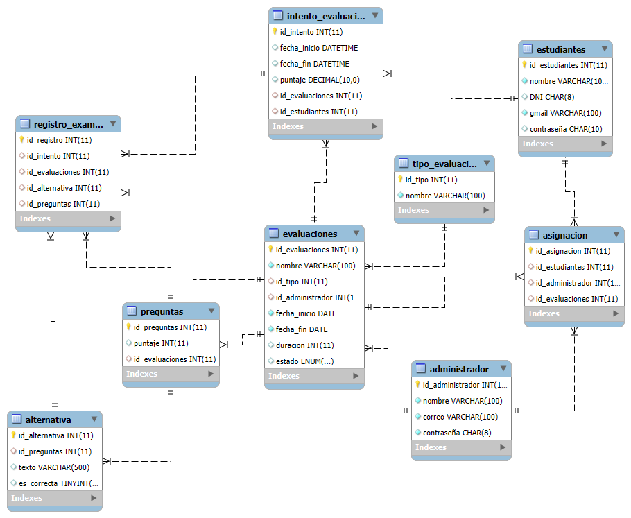

# Proyecto Base de Datos: Aprende_Perú

Este proyecto consiste en el diseño y desarrollo de una base de datos relacional para el sistema **"Aprende Perú"**, un centro de evaluación académica para estudiantes. Se ha implementado exclusivamente utilizando **consultas SQL** (CREATE, INSERT, SELECT, JOIN, etc.) y **tablas relacionales**.

##  Diagrama Entidad-Relación

A continuación se muestra el diseño del modelo entidad-relación de la base de datos:




---

## Objetivo

Diseñar una base de datos que permita:
- Registro de estudiantes y administradores.
- Evaluaciones académicas con preguntas y alternativas.
- Asignación de evaluaciones a estudiantes.
- Intentos de evaluación y resultados.

---

## Herramientas utilizadas

- **Sistema de gestión de base de datos:** MySQL
- **Herramientas de diseño:** MySQL Workbench (para el diagrama ER)
- **Lenguaje:** SQL (para consultas)

---

## Estructura de la base de datos

La base de datos se compone de las siguientes tablas principales:

| Tabla              | Descripción |
|--------------------|-------------|
| `estudiantes`      | Registro de estudiantes con nombres y datos de contacto. |
| `evaluaciones`     | Contiene las evaluaciones creadas. |
| `preguntas`        | Lista de preguntas para cada evaluación. |
| `alternativas`     | Respuestas posibles para cada pregunta. Una es la correcta. |
| `asignacion`  | Relaciona evaluaciones con estudiantes asignados. |
| `intento_evaluacion`     | Registra intentos de estudiantes en evaluaciones, puntaje, etc. |

---

## Conceptos Clave Aplicados

- **Modelado relacional**
- **Integridad referencial**
- **Relaciones uno a muchos y muchos a muchos**
- **Normalización de datos**
- **Consultas SQL complejas para reportes**


---

##  ¿Cómo usar este proyecto?

1. **Abrir tu herramienta de SQL** preferida.
2. **Ejecutar el archivo `aprende_peru.sql`** que contiene:
   - Creación de tablas.
   - Inserciones de datos de ejemplo.
3. Explorar y ejecutar consultas como:
   ```sql
   -- Número de exámenes inscritos, resueltos y pendientes para un alumno 
   SELECT 
    (SELECT COUNT(*) FROM asignacion WHERE id_estudiantes = 1) AS total_inscritos,
    (SELECT COUNT(*) FROM intento_evaluacion WHERE id_estudiantes = 1) AS resueltos,
    (SELECT COUNT(*) FROM asignacion WHERE id_estudiantes = 1) - 
    (SELECT COUNT(*) FROM intento_evaluacion WHERE id_estudiantes = 1) AS pendientes;


## Autor

[Sandra De La Cruz](https://github.com/Sandra120704/DB.sql.git)
